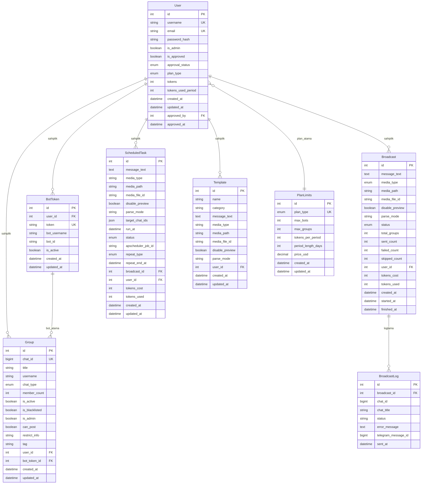
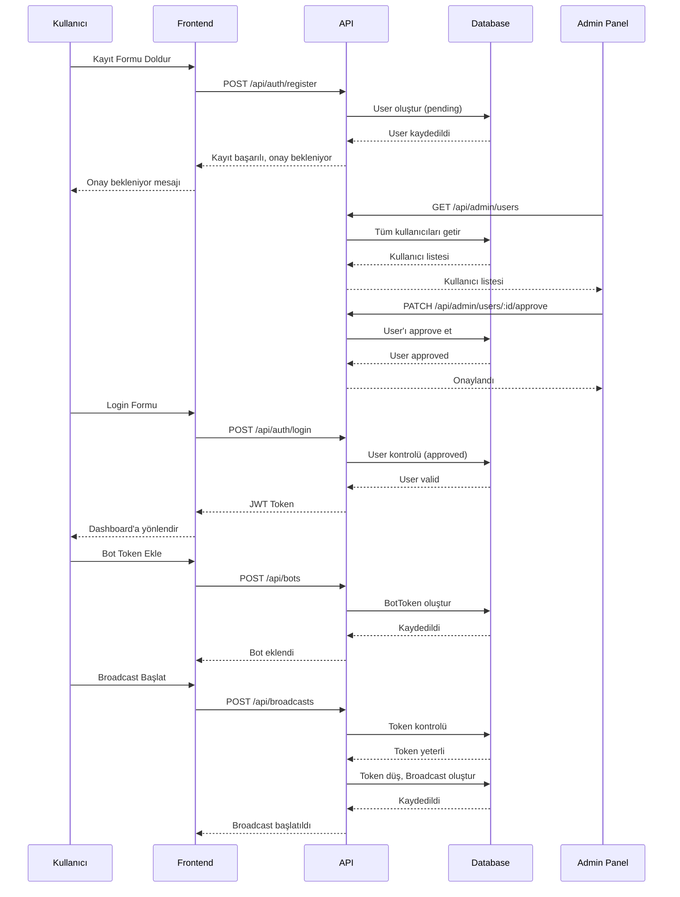
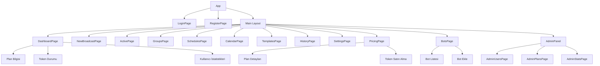
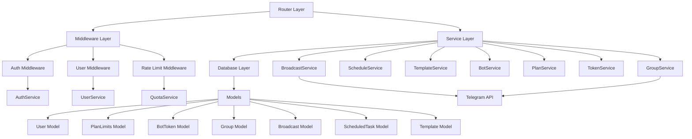
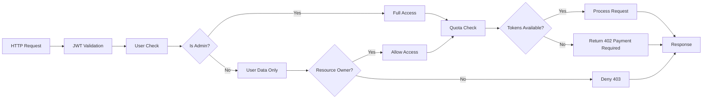
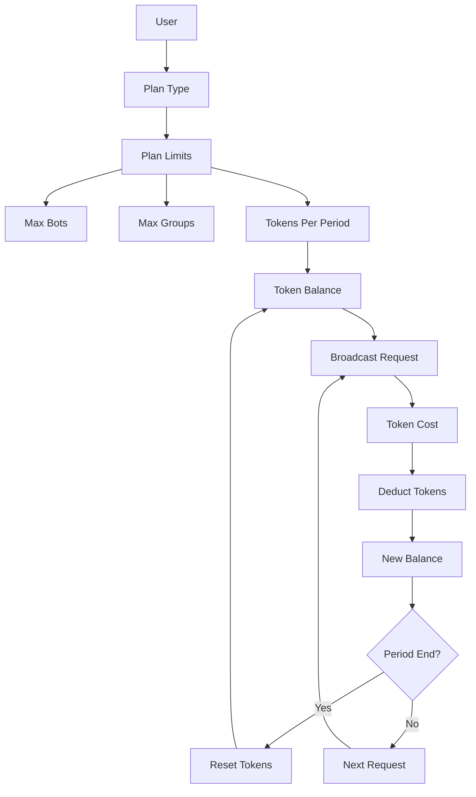

# Multi-Tenant SaaS - Sistem Mimarisi

## Veri Modeli İlişkileri

## API Endpoint Yapısı

```mermaid
graph TD
    Client[Client] --> Auth[Authentication]
    Client --> API[API Endpoints]
    
    Auth --> Login[POST /api/auth/login]
    Auth --> Register[POST /api/auth/register]
    Auth --> Me[GET /api/auth/me]
    
    API --> UserAPI[User API]
    API --> AdminAPI[Admin API]
    API --> BroadcastAPI[Broadcast API]
    API --> GroupAPI[Group API]
    API --> ScheduleAPI[Schedule API]
    API --> TemplateAPI[Template API]
    API --> BotAPI[Bot API]
    
    UserAPI --> Profile[GET/PUT /api/users/profile]
    UserAPI --> Tokens[GET /api/users/tokens]
    UserAPI --> Plan[GET /api/users/plan]
    
    AdminAPI --> Users[GET /api/admin/users]
    AdminAPI --> Approve[PATCH /api/admin/users/:id/approve]
    AdminAPI --> Reject[PATCH /api/admin/users/:id/reject]
    AdminAPI --> DeleteUser[DELETE /api/admin/users/:id]
    AdminAPI --> PlanLimits[GET/PATCH /api/admin/plan-limits]
    
    BroadcastAPI --> GetBroadcasts[GET /api/broadcasts]
    BroadcastAPI --> CreateBroadcast[POST /api/broadcasts]
    BroadcastAPI --> GetBroadcast[GET /api/broadcasts/:id]
    BroadcastAPI --> CancelBroadcast[PATCH /api/broadcasts/:id/cancel]
    
    GroupAPI --> GetGroups[GET /api/groups]
    GroupAPI --> AddGroup[POST /api/groups]
    GroupAPI --> UpdateGroup[PATCH /api/groups/:id]
    GroupAPI --> DeleteGroup[DELETE /api/groups/:id]
    
    ScheduleAPI --> GetSchedules[GET /api/schedules]
    ScheduleAPI --> CreateSchedule[POST /api/schedules]
    ScheduleAPI --> UpdateSchedule[PATCH /api/schedules/:id]
    ScheduleAPI --> DeleteSchedule[DELETE /api/schedules/:id]
    
    TemplateAPI --> GetTemplates[GET /api/templates]
    TemplateAPI --> CreateTemplate[POST /api/templates]
    TemplateAPI --> UpdateTemplate[PATCH /api/templates/:id]
    TemplateAPI --> DeleteTemplate[DELETE /api/templates/:id]
    
    BotAPI --> GetBots[GET /api/bots]
    BotAPI --> CreateBot[POST /api/bots]
    BotAPI --> GetBot[GET /api/bots/:id]
    BotAPI --> DeleteBot[DELETE /api/bots/:id]
    BotAPI --> ToggleBot[PATCH /api/bots/:id/toggle]
```

## Kullanıcı Akışı

## Frontend Sayfa Yapısı

## Backend Service Katmanı

## Güvenlik ve Yetkilendirme

## Plan ve Token Akışı

